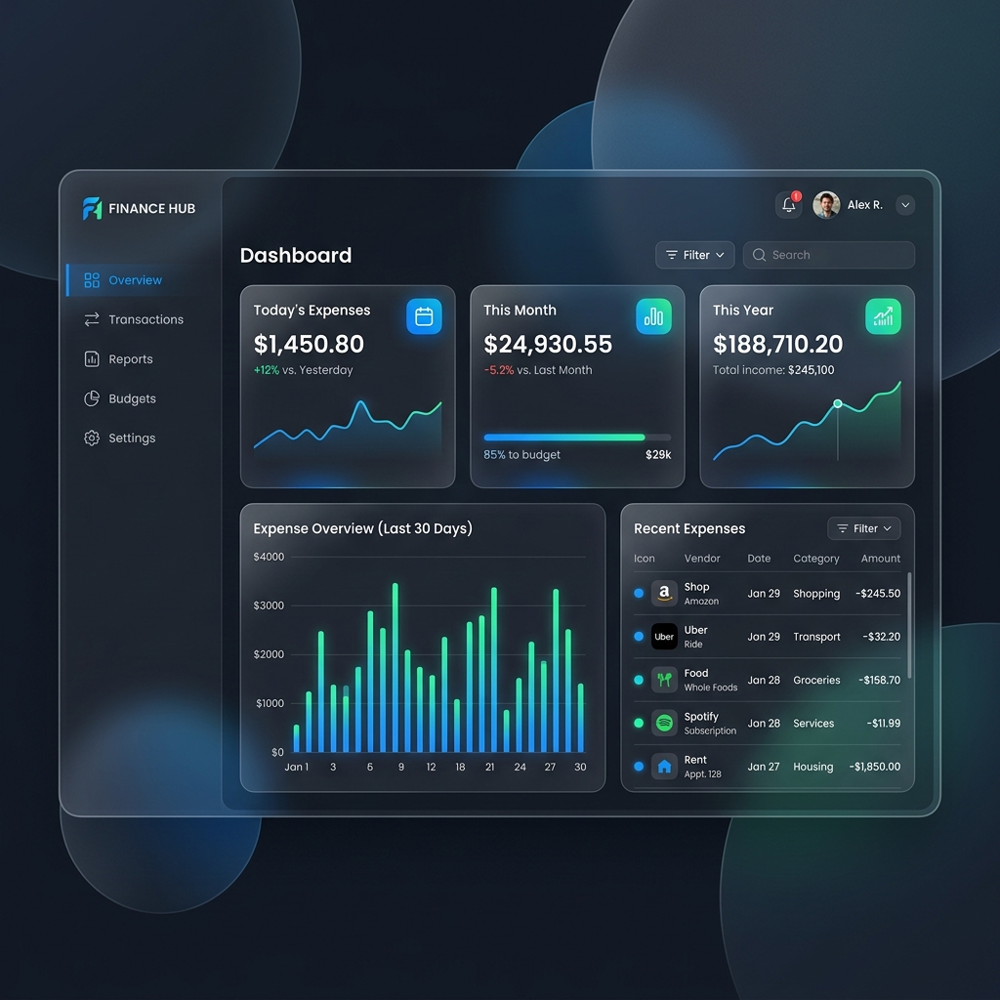
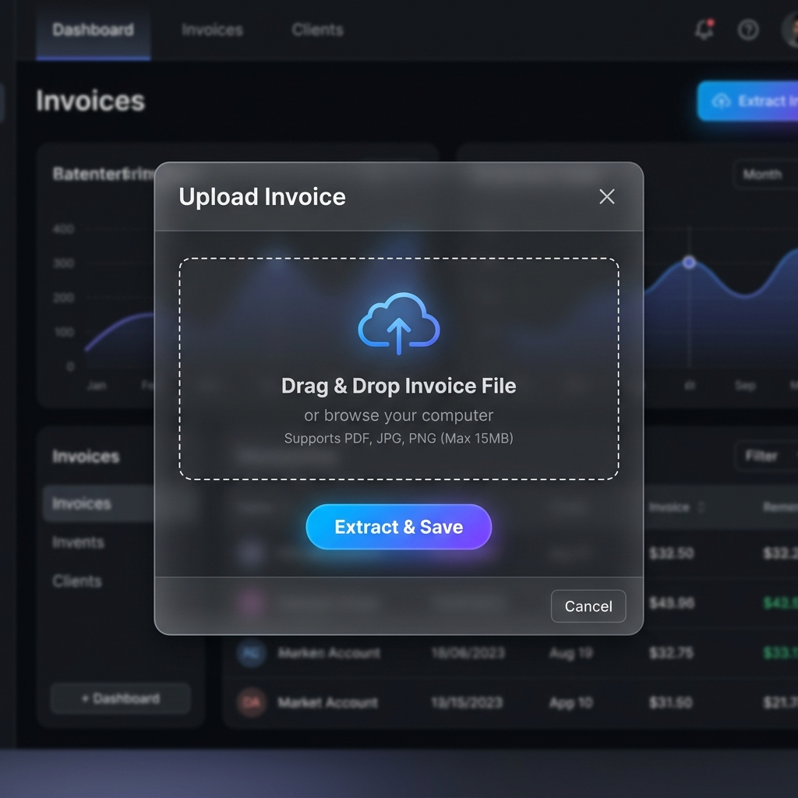

# Finance Hub

An AI-powered, modern web application for companies to effortlessly track, extract, and manage their expenses. Built with Next.js, Prisma, and the Google Gemini API.


*Dashboard Overview*


*Invoice Upload & Extraction Modal*

## Features

- **AI-Powered Data Extraction:** Upload your bills and invoices (PDFs/Images). The system uses the Google Gemini 1.5 Flash API to automatically extract Vendor names, Dates, Total Amounts, Tax, and Categories in structured JSON format.
- **Sleek Dashboard:** A rich, vibrant dark-mode dashboard with a glassmorphism design.
- **Analytics at a Glance:** Dynamic summary cards calculate your Daily, Monthly, and Yearly expenses instantly.
- **Interactive Charts:** Visualise your expense trends over the last 6 months.
- **Robust Database:** Fully integrated SQLite database via Prisma ORM.

## Tech Stack

- **Framework:** [Next.js (App Router)](https://nextjs.org/)
- **Styling:** Vanilla CSS (Glassmorphism & Micro-animations)
- **Database:** [SQLite](https://www.sqlite.org/index.html)
- **ORM:** [Prisma](https://www.prisma.io/)
- **AI Extraction:** [Google Gemini API](https://ai.google.dev/)
- **Charts:** [Recharts](https://recharts.org/)
- **Icons:** [Lucide React](https://lucide.dev/)

## Getting Started

Follow these steps to set up the project locally.

### 1. Clone the repository
```bash
git clone https://github.com/dinusugathan/Expense-Manager.git
cd Expense-Manager
```

### 2. Install Dependencies
```bash
npm install
```

### 3. Setup Environment Variables
Duplicate the `.env.example` file to create a `.env` file.
```bash
cp .env.example .env
```
Open the `.env` file and add your Google Gemini API Key:
```env
DATABASE_URL="file:./dev.db"
GEMINI_API_KEY="YOUR_ACTUAL_API_KEY_HERE"
```

### 4. Setup Database
Run the following commands to initialize the SQLite database and generate the Prisma Client:
```bash
npx prisma db push
npx prisma generate
```

### 5. Run the Application
```bash
npm run dev
```
Navigate to [http://localhost:3000](http://localhost:3000) in your browser.

## How to Use

1. Click on the **Upload Invoice** button on the dashboard.
2. Drag and drop your invoice image or PDF, and click **Extract & Save**.
3. The Gemini API will parse the document and the data will be securely saved into your database.
4. Your dashboard charts and summary cards will automatically update to reflect the new expense!

---
*Designed with a focus on modern web aesthetics and intelligent automation.*
